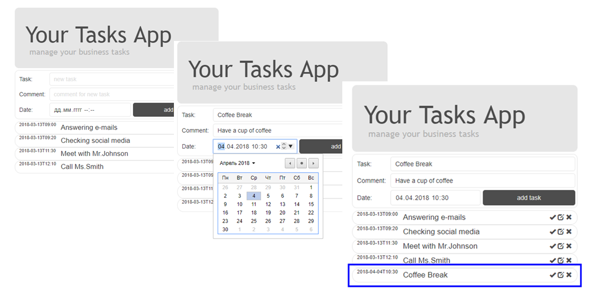

#Business-Taskbook

## Задание
Создайте приложение - бизнес-ежедневник.  
В приложении должно быть предусмотрено добавление, удаление и сортировка текущих заданий по дате.

## Комментарии
Приложение - бизнес(ежедневник), выполнено с использованием JS + ReactJS

Компонентная структура: Index.html <--> Index.js <--> App.js <--> TasksList.js <--> Task.js  
Начальные задачи(task-и) подгружаются в state slice-копированием из ./base of tasks/tasks.js

Присутствует поле ввода новой задачи и поле вывода списка текущих задачи.  
Сортировка по дате исполнения - автоматическая (setState).  

Присутствуют одна большая кнопка - добавить задачу и три bootstrap иконки (отметить как выполнено, редактировать и удалить). 
Текущие задачи снабжены всплывающим полем с комментарием.  
Выполненные задачи отмечаются цветом.  

Редактирование текущих задач осуществляется через поле ввода новой задачи.  

В приложении присутствует простая проверка валидности полей ввода с алерт-выводом.  

Присутствуют краткие комментарии по коду приложения.  

<i>Реализация - Production под NodeJS</i>
